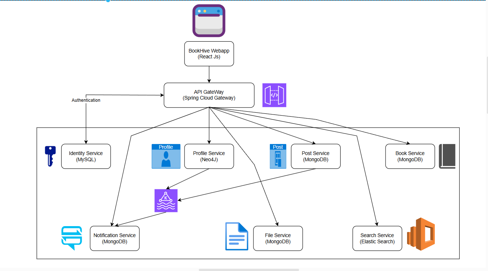

# BookHive - Một trang mạng xã hội, nơi mà chúng ta có thể chia sẻ và bàn luận với nhau về thế giới của những cuốn sách.
## 👩‍💻 Tổng Quan Hệ Thống
    Hệ thống được thiết kế theo kiến trúc Microservices như sau:
    
